# TP 15 – Expressions Lambda et Programmation Fonctionnelle en Java

## 🎯 Objectif
Découvrir et maîtriser les **expressions lambda en Java (Java 8+)** ainsi que leur utilisation
dans la programmation fonctionnelle moderne à travers des exemples pratiques.

---

## 🧩 Contenu du TP
Ce TP couvre les notions suivantes :

- Interfaces fonctionnelles (`Predicate`, `Function`, `Consumer`, `Supplier`)
- Expressions lambda (syntaxes simples et avancées)
- Références de méthodes (`::`)
- API **Stream** (filtrage, transformation, agrégation)
- Composition de fonctions (`andThen`, `compose`)
- Gestion des exceptions avec les lambdas
- Validation de données par règles fonctionnelles
- Création d’interfaces fonctionnelles personnalisées (`TriFunction`)
- Comparateurs composés avec `Comparator`
- Programmation fonctionnelle avec `IntStream`
- **Mémoïsation** (cache de fonctions – exemple Fibonacci)

---

## 🛠️ Technologies utilisées
- Java **JDK 17+**
- API `java.util.function`
- API `java.util.stream`
- Collections Java (`Map`, `List`)
- Programmation fonctionnelle

---

## Résultat visuel

<div align="center"> 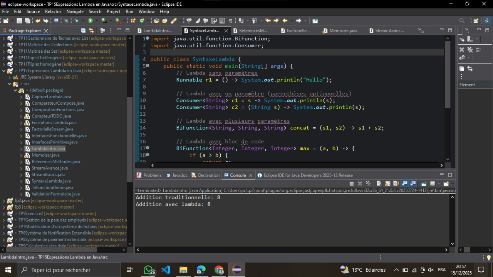 <p><em>Figure 1</em></p> </div>

<div align="center">  <p><em>Figure 2</em></p> </div>


<div align="center"> 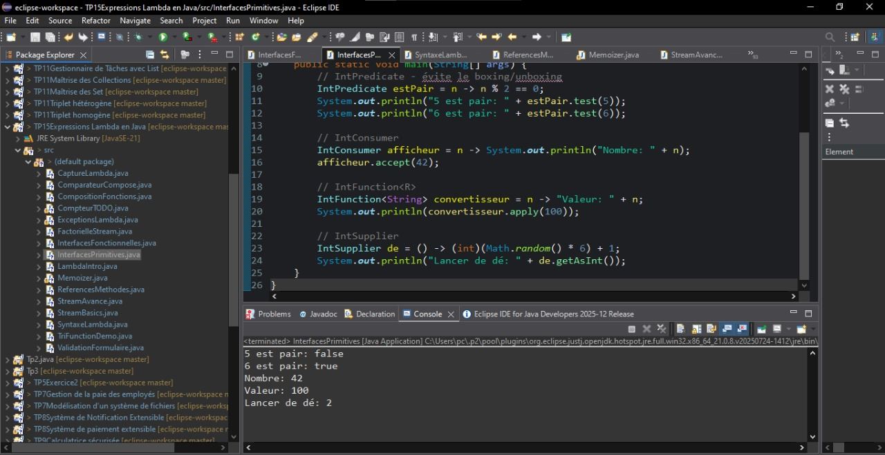 <p><em>Figure 3</em></p> </div>


<div align="center"> 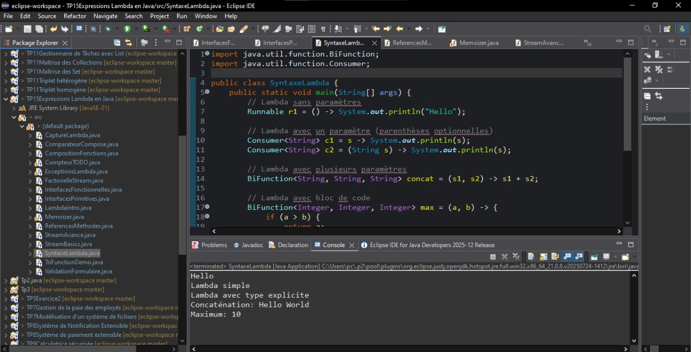 <p><em>Figure 4</em></p> </div>


<div align="center"> 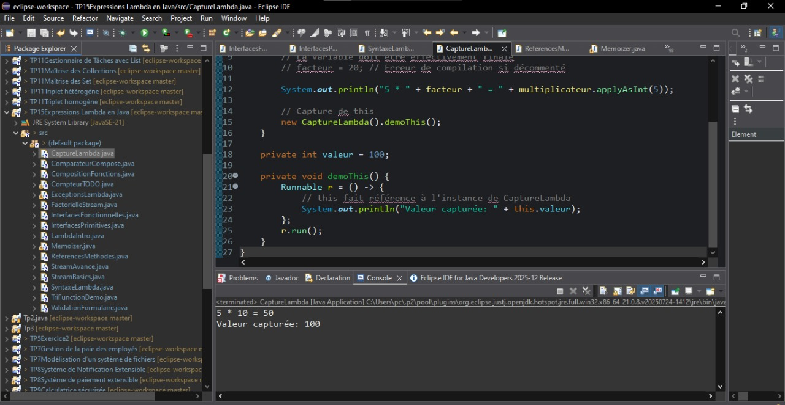 <p><em>Figure 5</em></p> </div>


<div align="center"> 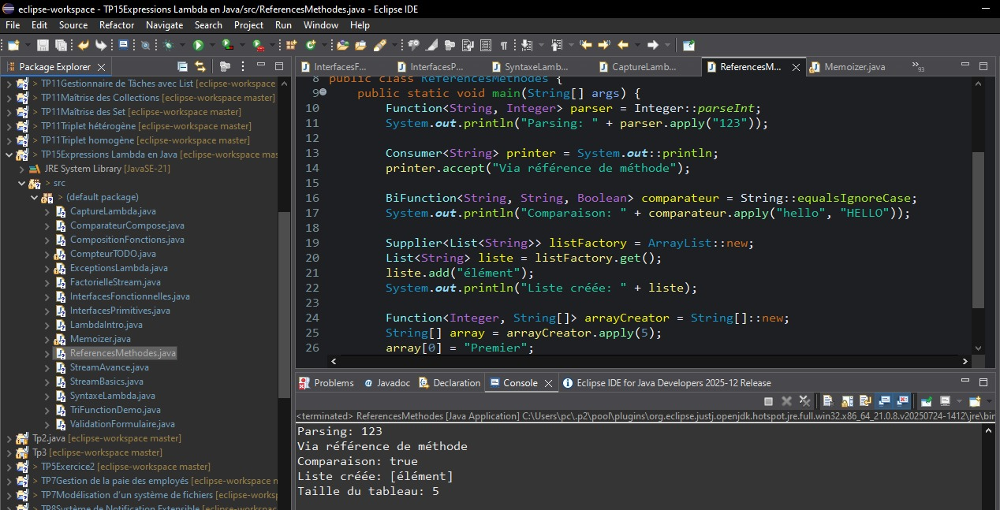 <p><em>Figure 6</em></p> </div>


<div align="center"> 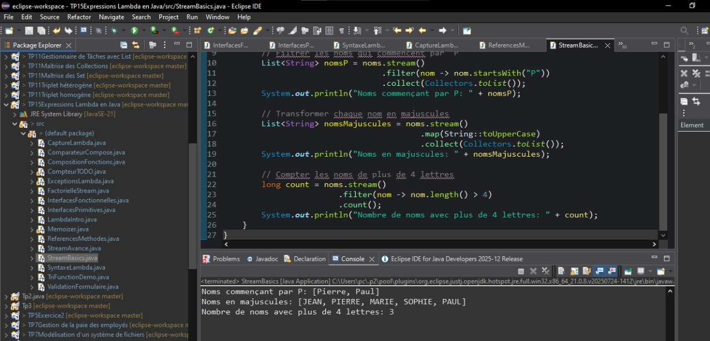 <p><em>Figure 7</em></p> </div>


<div align="center"> 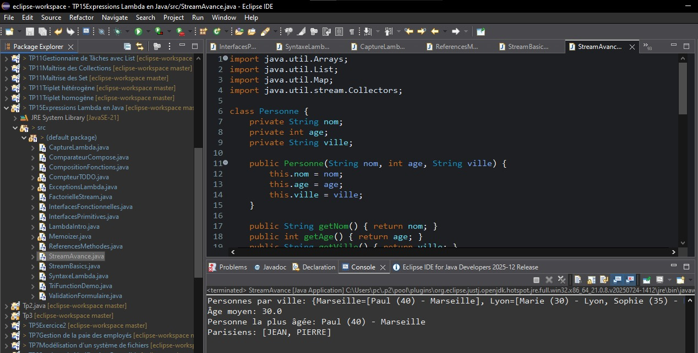 <p><em>Figure 8</em></p> </div>

<div align="center"> 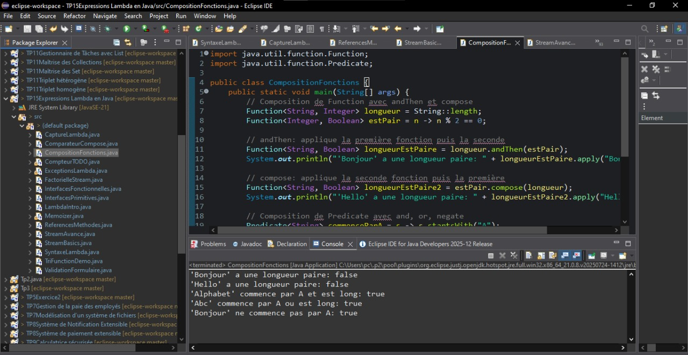 <p><em>Figure 9</em></p> </div>


<div align="center"> 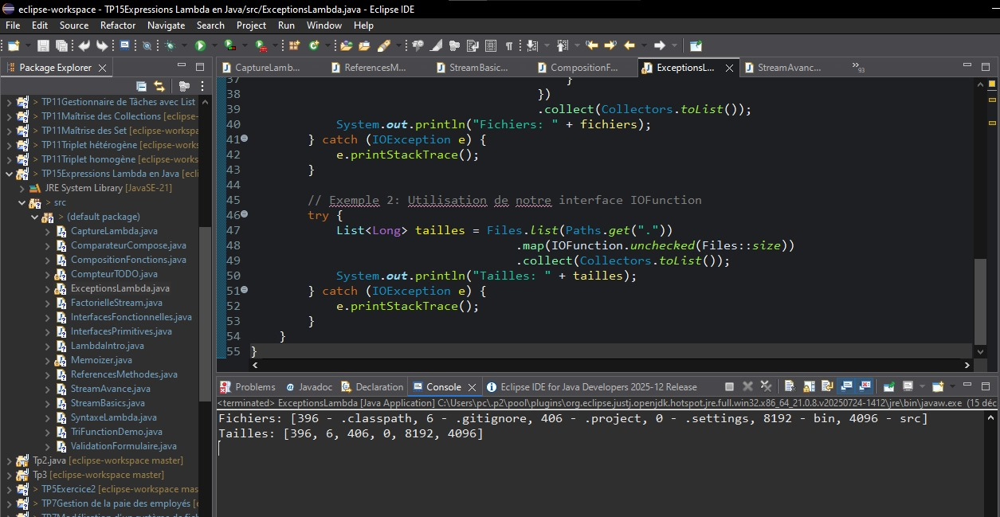 <p><em>Figure 10</em></p> </div>


<div align="center"> 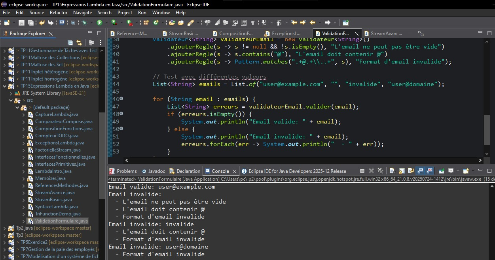 <p><em>Figure 11</em></p> </div>


<div align="center"> 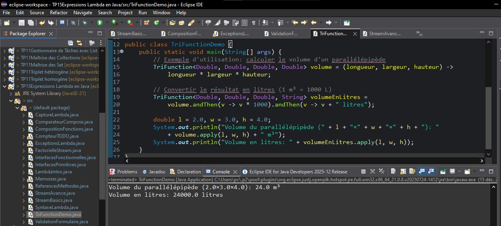 <p><em>Figure 12</em></p> </div>


<div align="center"> 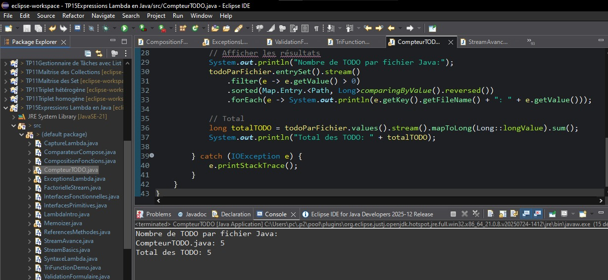 <p><em>Figure 13</em></p> </div>
<div align="center"> 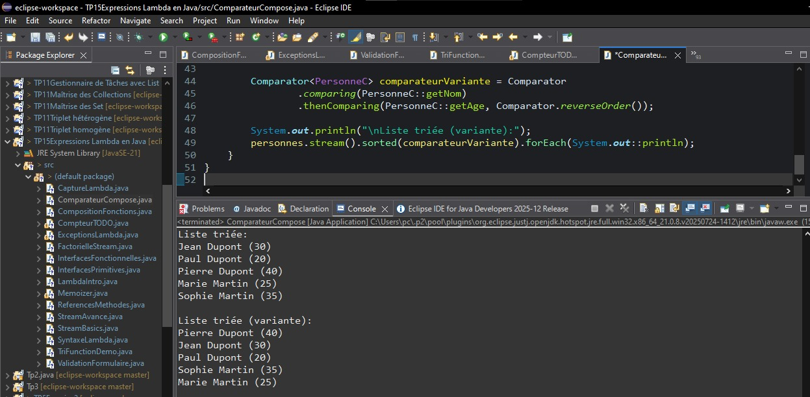 <p><em>Figure 14</em></p> </div>
<div align="center">  <p><em>Figure 14</em></p> </div>


## ▶️ Exécution
Compiler et exécuter un fichier :

```bash
javac NomDuFichier.java
java NomDuFichier
````
